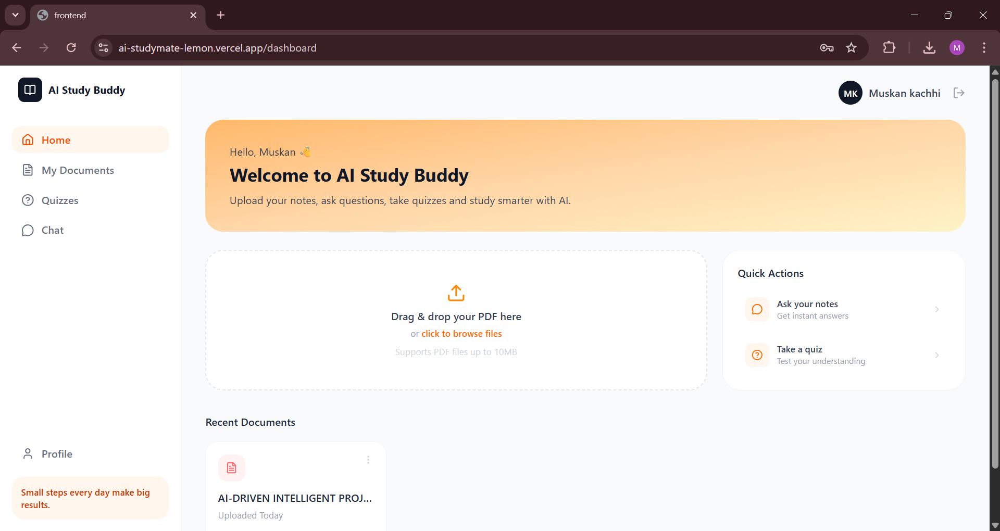
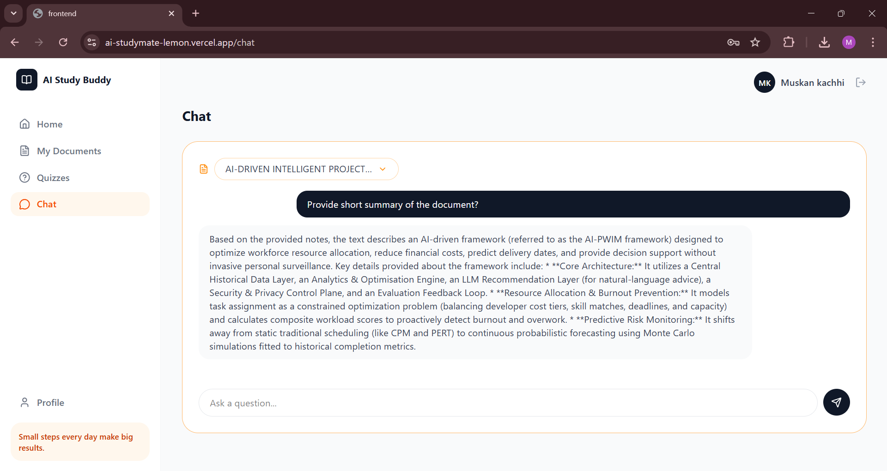
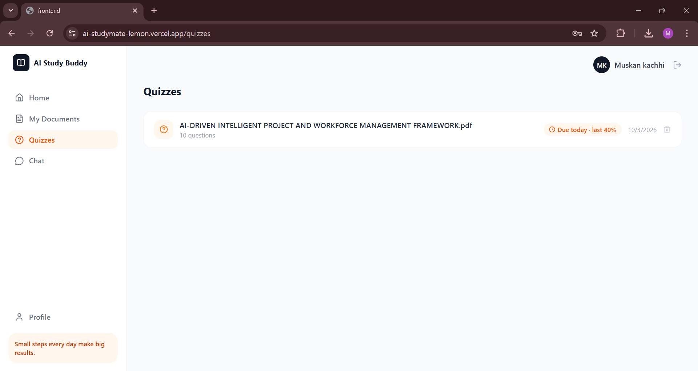

# AI StudyMate

An AI-powered study platform. Upload your notes as a PDF, chat with them, get auto-generated quizzes, and get reminded when to revise.

Live demo: https://ai-studymate-lemon.vercel.app

The backend runs on a free hosting plan and sleeps when idle, so the first request can take up to a minute.

## Screenshots







## Features

- **Chat with your notes (RAG):** ask questions and get answers based only on your uploaded PDF.
- **Quiz generation:** multiple-choice quizzes (5 to 20 questions) generated from the document and saved for later.
- **Revision scheduler:** a quiz score below 60% schedules a revision for the next day, otherwise in 5 days. Due and scheduled badges appear on the quiz pages.
- **Authentication:** email OTP verification, short-lived access tokens, rotating refresh tokens in httpOnly cookies, session tracking, logout from all devices, password reset and change password.
- **Document management:** upload, background processing with a live status (processing, ready, failed), and delete, which also removes the stored file and vectors.

## Tech stack

| Layer | Technology |
|---|---|
| Frontend | React (Vite), Tailwind CSS, React Router, Axios |
| Backend | Node.js, Express |
| Database | MongoDB Atlas (Mongoose) |
| File storage | Cloudinary |
| AI | Google Gemini (embeddings and text generation) |
| Vector search | Pinecone |
| Email | Brevo API in production, Nodemailer with Gmail locally |
| Hosting | Vercel (frontend), Render (backend) |

## How it works

```
Upload PDF -> Cloudinary -> extract text -> split into chunks
          -> Gemini embeddings -> store vectors in Pinecone

Question  -> embed question -> find closest chunks in Pinecone
          -> send chunks and question to Gemini -> answer

Quiz      -> pick chunks spread across the document -> Gemini returns JSON
          -> validate -> save in MongoDB -> score -> schedule revision
```

Design choices:

- **RAG instead of sending the whole PDF to the model:** cheaper, faster, and works on any new document without training.
- **Chunks of about 300 words with 50 words of overlap:** small enough for accurate search, and the overlap keeps an idea from being lost between two chunks.
- **Vector search instead of keyword search:** it finds text by meaning, so "car" can match "automobile".
- **Access and refresh tokens:** a stolen access token expires in minutes, and the refresh token is kept in an httpOnly cookie and rotated on every use.
- **Background processing:** the upload responds immediately and the document is processed afterwards, so the user never waits on a long request.

## Security

- Passwords hashed with bcrypt
- Email OTP with expiry and a limit of 5 wrong attempts
- Refresh token rotation with database-backed sessions
- Every document, quiz and revision request checks that the item belongs to the logged-in user
- Rate limiting on auth, OTP and AI routes
- Helmet security headers and CORS restricted to the frontend URL
- Input validation

## Project structure

```
backend/
  config/        env, database, Cloudinary, Pinecone, upload settings
  controllers/   auth, otp, document, revision
  middleware/    auth check, rate limits, error handling
  models/        User, Session, Otp, Document, Quiz, RevisionLog
  routes/        URL definitions
  services/      Gemini, Pinecone, PDF, document processing, tokens, mail
  utils/         chunking and validation helpers
frontend/
  src/pages/       Login, Register, VerifyOtp, Dashboard, Chat, Quizzes, ...
  src/components/  sidebar, topbar, dropdown, protected route
  src/context/     auth state
  src/api/         Axios client and API calls
```

## Run locally

You need Node.js 18 or newer and accounts for MongoDB Atlas, Cloudinary, Google AI Studio (Gemini) and Pinecone. Create the Pinecone index with dimension 3072 and cosine metric.

```bash
git clone https://github.com/muskan-2805/AI-studymate.git
cd AI-studymate
```

Backend:

```bash
cd backend
npm install
npm run dev
```

Create `backend/.env` with the variables listed below before starting it.

Frontend, in a second terminal:

```bash
cd frontend
npm install
npm run dev
```

The frontend runs on http://localhost:5173 and the backend on http://localhost:5000. To use a different backend URL, create `frontend/.env` with `VITE_API_URL=<backend url>/api`.

### Backend environment variables

```
PORT=5000
NODE_ENV=development
CLIENT_URL=http://localhost:5173

MONGO_URI=
JWT_ACCESS_SECRET=
JWT_REFRESH_SECRET=

GMAIL_USER=
GMAIL_APP_PASSWORD=

CLOUDINARY_CLOUD_NAME=
CLOUDINARY_API_KEY=
CLOUDINARY_API_SECRET=

GEMINI_API_KEY=
GEMINI_MODEL=

PINECONE_API_KEY=
PINECONE_INDEX_NAME=
```

For production, set `NODE_ENV=production` and `CLIENT_URL` to the frontend URL. Use `BREVO_API_KEY` and `MAIL_FROM_EMAIL` (a verified Brevo sender) instead of the Gmail variables, because Render's free plan blocks SMTP.

## API overview

| Area | Endpoints |
|---|---|
| Auth | `POST /api/auth/register`, `login`, `refresh`, `logout`, `logout-all`, `forgot-password`, `reset-password`; `GET /api/auth/me`; `PUT /api/auth/profile`, `change-password` |
| OTP | `POST /api/otp/send`, `POST /api/otp/verify` |
| Documents | `POST /api/documents/upload`, `GET /api/documents`, `DELETE /api/documents/:id`, `POST /api/documents/:id/ask`, `POST /api/documents/:id/quiz` |
| Quizzes | `GET /api/documents/quizzes/all`, `GET` and `DELETE /api/documents/quiz/:quizId` |
| Revision | `POST /api/revision/log`, `GET /api/revision/today`, `GET /api/revision/all` |
| Health | `GET /api/health` |

## Limitations

- Scanned (image-only) PDFs are not supported because there is no OCR step.
- Documents are processed inside the server process. If the server restarts during processing, that document is marked as failed. A job queue such as BullMQ with Redis would fix this.
- The revision schedule uses a simple score rule, not a full spaced-repetition algorithm like SM-2.
- No automated tests yet.
